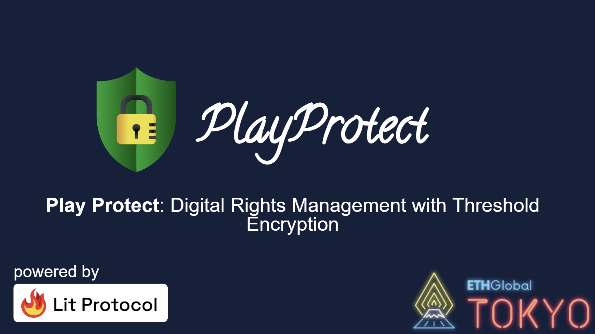
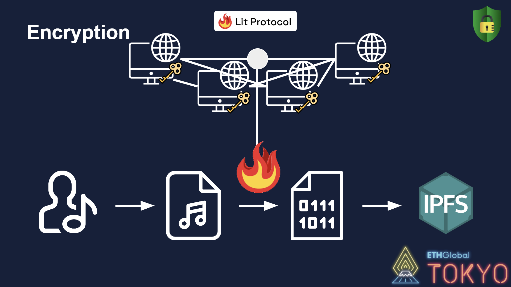
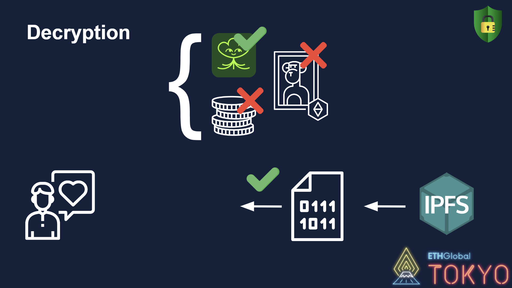

# **Play Protect**



Play Protect is a tool that empowers artists by giving them the ability of enforce digital rights management for their music, in a decentralized manner, using threshold encryption.


*(This project was build during [ETH Tokyo Hackathon](https://ethglobal.com/events/tokyo) from April 14 to April 16, 2023)*

---

## **The problem**

The music industry is facing a lot of challenges, from piracy to the lack of transparency and the lack of control over their music.

Despite certain cultural trends and negative sentiments towards digital rights management, an artist's best ally for protecting the value of their work is encryption.

---

## **The solution**

By harnessing the power of encryption, **Play Protect** allows an artist to publish their music on public channels (such as IPFS) without exposing their creative works to piracy or otherwise diminishing the value of their work.



**Play Protect** utilizes threshold encryption so that no single node or centralized entity holds the keys to decrypt artist content, thereby reducing chances of piracy and large-scale exploits. This is powered by Lit Protocol: a blockchain-agnostic middleware layer that can read and write data between blockchains and off-chain platforms, powering conditional decryption and programmatic signing. 


**Play Protect** allows artists to truly own their intellectual property and grant streaming or download licenses to users that meet certain arbitrary, artist-defined conditions.



Those conditions may be either on-chain or off-chain. Some examples include granting streaming licenses to fans who are followers of the artists on [**Lens protocol**](https://www.lens.xyz/), or granting download licenses to fans who own a particular NFT issued by an artist.

---

# **Conclusions**

>Despite some resistance towards digital rights management, encryption can be an effective tool for artists to protect the value of their work.

**Play Protect** provides a decentralized and secure platform for artists to distribute their music while ensuring that their intellectual property remains safe from piracy and exploitation. Through the use of threshold encryption, Play Protect enables artists to control access to their content, granting licenses based on conditions set by the artist.

This technology empowers artists to distribute their work in a more sovereign and independent way, reducing their reliance on centralized platforms and allowing them to maintain control over their creative output.

> [Link for the presentation slides](https://docs.google.com/presentation/d/1Eur9VfmrnEYFwrkXFDXmE9vJj_11cL7N8hl6kLQpmgk/edit?usp=sharing)

# **Run the app locally**

To run our frontend at `localhost:3000`, first clone the repo

```bash
git clone git@github.com:luksgrin/ETHTokyo_Project.git
```

and then execute the following commands:

```bash
pnpm install
pnpm run dev
```